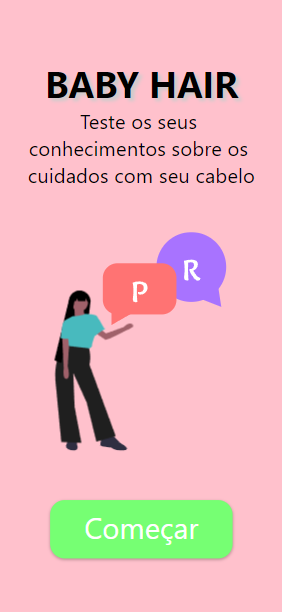
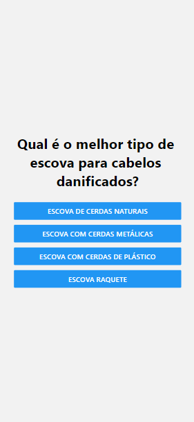

# :woman: Baby Hair Quiz

* Trabalho da disciplina de Mobile no curso de ADS da [Fatec Itu](https://fatecitu.edu.br/portal/cursos/analise-e-desenvolvimento-de-sistemas/)
* App React-Native/Expo de **Jogo de Perguntas e Respostas** sobre cuidados e conhecimentos com o cabelo

---

## :books: Informações Gerais
- React [useState hook](https://reactjs.org/docs/hooks-state.html) utilizado para o controle da sequencia das perguntas, controle da pontuação, a seleção do sons das respostas e as animações das respostas.
- React [useEffect hook](https://reactjs.org/docs/hooks-effect.html) utilizado para ativação do som das respostas.

## :camera: Screenshots

## :signal_strength: Tecnologias

* [Expo v44](https://docs.expo.io/) - Framework e plataforma para aplicações React, instalada globalmente;
* [React Native 0.71.4](https://reactnative.dev/) para criar o aplicativos nativos para Android e iOS;
* [React Native Web 0.18.11](https://www.npmjs.com/package/react-native-web) - Componentes e APIs para Web;
* [Moti](https://moti.fyi) - Pacote de animação universal para React Native

## :floppy_disk: Setup

* Rode `npm i` ou `yarn` para instalar as dependências
* Execute `npm i -g expo-cli` para instalar o Expo CLI globalmente
* Rode `expo start` para iniciar a aplicação expo localmente

## :point_right: Integrantes
* [Grazielle Nascimento Ferreira](https://github.com/Grazielle127)

